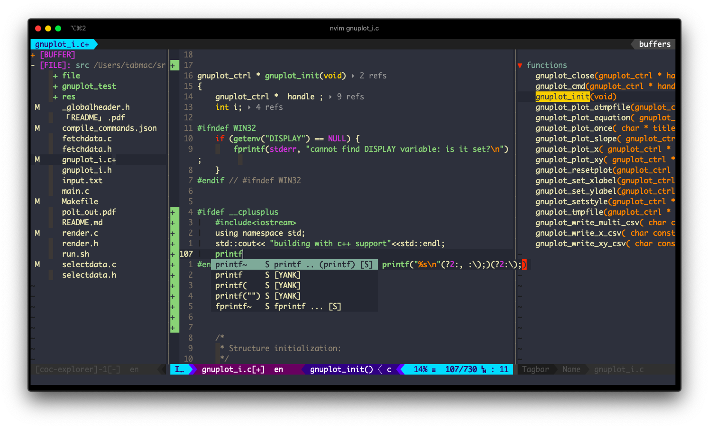
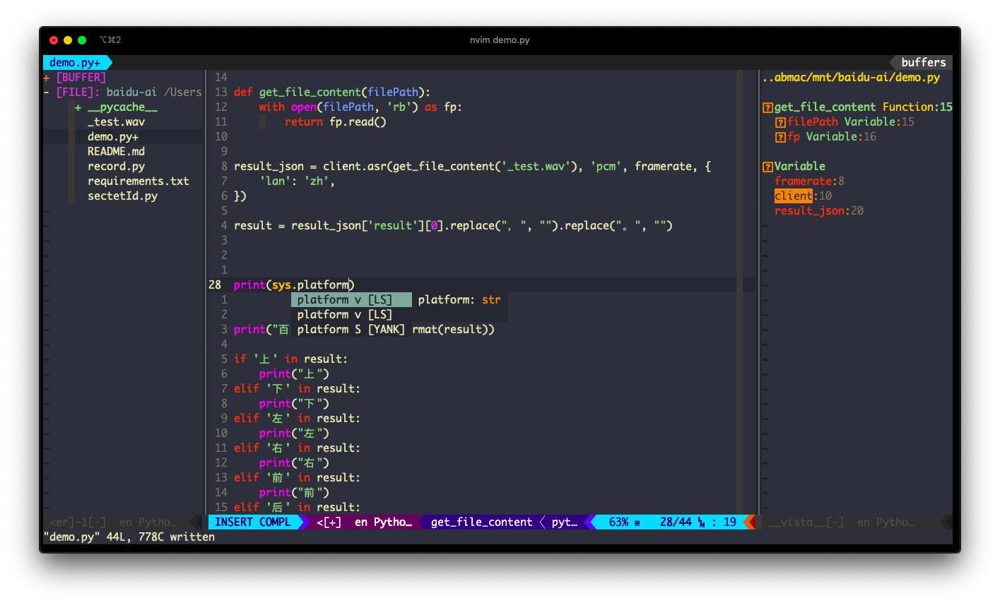

```html                         
                                     
 _   _                 _              ____             __ _                       _   _              
| \ | | ___  _____   _(_)_ __ ___    / ___|___  _ __  / _(_) __ _ _   _ _ __ __ _| |_(_) ___  _ __   
|  \| |/ _ \/ _ \ \ / / | '_ ` _ \  | |   / _ \| '_ \| |_| |/ _` | | | | '__/ _` | __| |/ _ \| '_ \  
| |\  |  __/ (_) \ V /| | | | | | | | |__| (_) | | | |  _| | (_| | |_| | | | (_| | |_| | (_) | | | | 
|_| \_|\___|\___/ \_/ |_|_| |_| |_|  \____\___/|_| |_|_| |_|\__, |\__,_|_|  \__,_|\__|_|\___/|_| |_| 
                                                            |___/                                    
```
### Supported Launage
- c/c++/python/go/bash/markdown

<div align="center">
 <br/>
(c-lang ide)
 <br/>
(python dev ide)
</div>

## feature
- neovim
- workflow
- ide

## Index
- [Installation](#installation)
- [Keyboard Shortcuts](#keyboard-shortcuts)
	- [1. Basic Keyboard Shortcuts](#1-basic-editor-features)
		- [1.1 The Most Basics](#1.1-the-most-basics)
		- [1.5 Other Useful Normal Mode Remapping](#1.5-other-useful-normal-mode-remapping)
	- [2. Window Management](#2-window-management)
		- [2.1 Creating Window Through Split Screen](#2.1-creating-window-through-split-screen)
		- [2.2 Moving the Cursor Between Different Windows](#2.2-moving-the-cursor-between-different-windows)
	- [3. Tab Management](#3-tab-management)
	- [4. Terminal Keyboard Shortcuts](#4-terminal-keyboard-shortcuts)
- [Plugin Shortcuts](#plugins)
	- AutoComplete / Snippets
		- [COC](#for-code-autocomplete---coc)
		- [Ultisnips](#ultisnips)
	- File Browsing/Management
		- [NERDTree](#nerdtree)
		- [Ranger.vim](#ranger.vim---file-browser)
		- [FZF](#fzf---the-fuzzy-file-finder)
	- Git
		- [GV](#gv---commit-browser)
		- [GitGutter](#gitgutter)
		- [fzf-gitignore](#fzf-gitignore)
	- Find / Replace
		- [FlyGrep](#flygrep---search-in-files)
		- [far.vim](#far.vim---find-and-replace)
	- Text Editing
		- [vim-table-mode](#vim-table-mode)
		- [vim-multiple-cursors](#vim-multiple-cursors)
		- [vim-surround](#vim-surround)
	- Editor Enhancement
		- [Vista.vim](#vista.vim) (Taglist)
		- [Undotree](#undotree)
		- [vim-startify](#vim-startify---startup-screen) (Startup Screen)
		- [vim-signiture](#vim-signiture---bookmarks) (Bookmarks)
		- [AutoFormat](#autoformat)
		- [Goyo](#goyo---work-without-distraction) (Remove distractions)
	- Vim Apps
		- [vim-starify](#vim-starify)
- [Custom Markdown Snippets](#custom-snippets)


## Installation
**Mac**
``` sh 
 #launch_proxy if necessary
 brew install nodejs ccls npm python ctags
 npm install -g neovim
 pip install neovim
 git clone https://github.com/ioperations/nvim ~/.config/nvim
 nvim +PlugInstall +UpdateRemotePlugins +checkhealth
 #fill in the blacks nvim provided
```
**Debian**
``` sh 
 #launch_proxy if necessary
 sudo apt install -y nodejs ccls npm python3-pip ctags build-essential
 npm install -g neovim bash-language-server
 pip install neovim virtualenv
 git clone https://github.com/ioperations/nvim ~/.config/nvim
 nvim +PlugInstall +UpdateRemotePlugins +checkhealth
 #fill in the blacks nvim provided
```


## Keyboard Shortcuts
### 1 Basic Editor Features
#### 1.1 The Most Basics
**`Q`** : quit current vim window, equals to command `:q`
**`S`** : save the current file, equals to command `:w`


#### 1.2 Basic Cursor Movement
| Shortcut   | Action                                                    |
|------------|-----------------------------------------------------------|
| `k`        | Cursor up a terminal line                                 |
| `j`        | Cursor down a terminal line                               |
| `h`        | Cursor left                                               |
| `l`        | Cursor right                                              |
| `0`        | Cursor to the start of the line                           |
| `$`        | Cursor to the end of the line                             |
| `Ctrl` `y` | Move the view port up 5 lines without moving the cursor   |
| `Ctrl` `e` | Move the view port down 5 lines without moving the cursor |
| `w`        | Move to the start of next word                            |
| `b`        | Move to the start of this word                            |
| `e`        | Move to the end of this word                              |
| `W`        | Move cursor five words forward                            |
| `B`        | Move cursor five words backword                           |

#### 1.4 Basic Text Manipulating Commands in Normal Mode
| Shortcut        | Action                                |
|-----------------|---------------------------------------|
| `u`             | **undo**                              |
| `<`             | Un-indent                             |
| `>`             | Indent                                |
| `Ctrl` `a`      | Increase the number under cursor by 1 |
| `Ctrl` `x`      | Decrease the number under cursor by 1 |
| `SPACE` `SPACE` | Goto the next placeholder (`<++>`)    |

#### 1.5 Other Useful Normal Mode Remapping
| Shortcut        | Action                                 |
|-----------------|----------------------------------------|
| `<leader>dd`    | **Compile/Run the current file c/c++/python/go/sh/make**       |
| `Y`             | Copy selected text to system clipboard |
| `z` `=`         | Show spell suggestions                 |
| `SPACE` `s` `c` | Toggle spell suggestion a              |
| `SPACE` `d` `w` | Find adjacent duplicated word          |
| `SPACE` `t` `t` | Convert every 4 Spaces to a tab        |
| `SPACE` `o`     | Fold                                   |
| `SPACE` `-`     | Previous quick-fix position            |
| `SPACE` `+`     | Next quick-fix position                |
| `\` `p`         | Show the path of the current file      |
| `r` `!{SHELL_CMD}` |  return the SHELL_CMD result to current line     |

### 2 Window Management
#### 2.1 Creating Window Through Split Screen
| Shortcut    | Action                                                                      |
|-------------|-----------------------------------------------------------------------------|
| `s` `k`     | Create a new horizontal split screen and place it above the current window  |
| `s` `j`     | Create a new horizontal split screen and place it below the current window  |
| `s` `h`     | Create a new vertical split screen and place it left to the current window  |
| `s` `l`     | Create a new vertical split screen and place it right to the current window |
| `s` `r` `v` | Rotate splits and arrange splits vertically                                 |
| `s` `r` `h` | Rotate splits and arrange splits horizontally                               |

#### 2.2 Moving the Cursor Between Different Windows
| Shortcut      | Action                         |
|---------------|--------------------------------|
| `<leader>` + `w` | Move cursor to the next window |
| `<leader>` + `h` | Move cursor one window left    |
| `<leader>` + `l` | Move cursor one window right   |
| `<leader>` + `k` | Move cursor one window up      |
| `<leader>` + `j` | Move cursor one window down    |

### 3 Tab Management
| Shortcut    | Action           |
|-------------|------------------|
| `t` `u`     | Create a new tab |
| `t` `h`     | Go one tab left  |
| `t` `l`     | Go One tab right |

### 4 Terminal Keyboard Shortcuts
| Shortcut    | Action                                                      |
|-------------|-------------------------------------------------------------|
| `SPACE` `/` | Create a new split with a terminal below the current window |
| `Ctrl` `N`  | Escape from terminal input mode                             |

## Plugins
#### COC (AutoCompletion)
| Shortcut        | Action                    |
|-----------------|---------------------------|
| `Space` `y`     | **Get yank history list** |
| `gd`            | Go to definition          |
| `gr`            | List references           |
| `gi`            | List implementation       |
| `gy`            | Go to type definition     |
| `Space` `r` `n` | Rename a variable         |

#### Ultisnips
| Shortcut   | Action                                           |
|------------|--------------------------------------------------|
| `<leader>` `<tab>` | Expand a snippet                                 |

#### NERDTree
| Shortcut          | Action              |
|-------------------|---------------------|
| `tt`              | **Toggle NerdTree** |
| `I`               | Open in new split   |
| `O`               | Open in new tab     |
| `l`               | Change root         |
| `z` `h`           | Toggle hidden       |
| `,` (in NERDTREE) | Toggle menu         |

#### GitGutter
| Shortcut        | Action                            |
|-----------------|-----------------------------------|
| `H`             | **Show git hunk at current line** |
| `SPACE` `g` `-` | Go to previous git hunk           |
| `SPACE` `g` `+` | Go to next git hunk               |
| `SPACE` `g` `f` | Fold everything except hunks      |

#### vim-table-mode
| Shortcut        | Action            |
|-----------------|-------------------|
| `SPACE` `t` `m` | Toggle table mode |
| `SPACE` `t` `r` | Realign table     |

See `:help table-mode.txt` for more.

#### Vista.vim
| Shortcut   | Action                              |
|------------|-------------------------------------|
| `Ctrl` `t` | open function/class/variable finder |

#### FZF - the fuzzy file finder
| Shortcut   | Action           |
|------------|------------------|
| `Ctrl` `p` | **Active FZF**   |
| `Ctrl` `u` | Move up 1 item   |
| `Ctrl` `e` | Move down 1 item |

#### Undotree
| Shortcut      | Action          |
|---------------|-----------------|
| `Shift` + `L` | Open Undotree   |
| `Shift` + `K` | History go up   |
| `Shift` + `J` | History go down |

#### Ranger.vim - file browser
- [ ] Make sure you have ranger installed
Press `R` to open Ranger (file selector)

#### vim-startify - Startup screen
Press `<leader>` `s` `t` to openup `startify`
And by default if there being no args recognized as file name,vim auto
start `startify`

#### vim-signiture - Bookmarks
| Shortcut    | Action                          | Command |
|-------------|---------------------------------|---------|
| `m<letter>` | Add/remove mark at current line |         |
| `m/`        | List all marks                  |         |
| `mSPACE`    | Jump to the next mark in buffer |         |

For more commands, see [here](https://github.com/MattesGroeger/vim-bookmarks#usage)

#### vim-multiple-cursors
| Shortcut   | Action                              |
|------------|-------------------------------------|
| `Ctrl`+`k` | Select next word (multiple cursors) |
| `Ctrl`+`p` | Select previous word                |
| `Ctrl`+`x` | Skip word                           |
| `Esc`      | Quit mutiple cursors                |

#### vim-surround
To add surround (`string` -> `"string"`):
```
string
```
press: `yskw'`:
```
'string'
```

To change surround
```
'string'
```
press: `cs'"`:
```
"string"
```

#### far.vim - find and replace
| Shortcut        | Action                   |
|-----------------|--------------------------|
| `SPACE` `f` `a` | Find in the current file |
| `SPACE` `f` `r` | Find and replace         |

#### FlyGrep - search in files
Press `Ctrl` `f` to search in files (content)

#### fzf-gitignore
Press `Space` `g` `i` to create a `.gitignore` file

#### GV - commit browser
| Shortcut | Action              |
|----------|---------------------|
| `g` `v`  | Open commit browser |
| `q`      | Quit GV window      |

#### AutoFormat
Press `\` `f` to format code

#### Goyo - Work without distraction
Press `g` `y` to toggle Goyo

## Custom Snippets
#### Markdown
| Shortcut | What it creates     |
|----------|---------------------|
| `,n`     | ---                 |
| `,b`     | **Bold** text       |
| `,s`     | ~~sliced~~ text     |
| `,i`     | *italic* text       |
| `,d`     | `code block`        |
| `,c`     | big `block of code` |
| `,m`     | - [ ] check mark    |
| `,p`     | picture             |
| `,a`     | [link]()            |
| `,1`     | # H1                |
| `,2`     | ## H2               |
| `,3`     | ### H3              |
| `,4`     | #### H4             |
| `,l`     | --------            |

`,f` to go to the next `<++>` (placeholder)

`,w` to go to the next `<++>` (placeholder) and then press `Enter` for you

# Suggestions
- Still,If you work in python-lang dev process use [virtualenv] to have multiple python env
